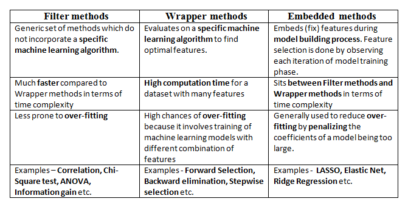

# Feature Selection:

## Wrapper Methods:
### Forward Selection:
Steps for the forward selection technique are as follows:
- Choose a significance level (e.g. SL = 0.05 with a 95% confidence).
- Fit all possible simple regression models by considering one feature at a time. Total ’n’ models are possible. Select the feature with the lowest p-value.
- Fit all possible models with one extra feature added to the previously selected feature(s).
- Again, select the feature with a minimum p-value. if p_value < significance level then go to Step 3, otherwise terminate the process.

### Backward Elimination:
Steps involved in backward elimination are as follows:
- Choose a significance level (e.g. SL = 0.05 with a 95% confidence).
- Fit a full model including all the features.
- Consider the feature with the highest p-value. If the p-value > significance level then go to Step 4, otherwise terminate the process.
- Remove the feature which is under consideration.
- Fit a model without this feature. Repeat the entire process from Step 3.

### Step-Wise Selection:
Steps involved in bi-directional elimination are as follows:
- Choose a significance level to enter and exit the model (e.g. SL_in = 0.05 and SL_out = 0.05 with 95% confidence).
- Perform the next step of forward selection (newly added feature must have p-value < SL_in to enter).
- Perform all steps of backward elimination (any previously added feature with p-value>SL_out is ready to exit the model).
- Repeat steps 2 and 3 until we get a final optimal set of features.

Implemented Methods:
- [ ] select
- [ ] forward\_select
- [ ] backward\_select
- [ ] step\_wise\_select
- [ ] random\_forrest
- [ ] pearson
- [ ] vif
- [ ] lasso